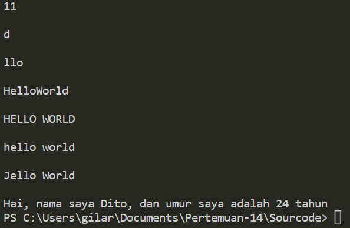

# Pertemuan-14

## Profil
| Variable | Isi |
| -------- | --- |
| **Nama** | Gilar Sumilar |
| **NIM** | 312210407 |
| **Kelas** | TI.22.A.4 |
| **Mata Kuliah** | Bahasa Pemrograman |

# String Lanjutan 

## What is Python String?
- String adalah jenis yang paling populer di Python. 
- Untuk membuatnya hanya dengan melampirkan 
  karakter dalam tanda kutip. 
- Python memperlakukan tanda kutip tunggal sama 
  dengan tanda kutip ganda. 
- Membuat string semudah memberi nilai pada sebuah 
  variabel
  
### Latihan
#### `txt = 'Hello World'`

- Hitung jumlah karakternya
- Ambil karakter terakhir
- Ambil karakter index ke-2 sampai index ke-4 (llo)
- Hilangkan spasi pada text tersebut (HelloWorld)
- Ubah text menjadi huruf besar
- Ubah text menjadi huruf kecil
- Ganti karakter H dengan karakter J

### Latihan 2
- Lengkapi kode tersebut
``` Python
umur = 24
txt = 'Hello, nama saya john, dan umur saya adalah__tahun'
print(txt.format(umur))
```
### Codingan

``` Python
# Hitung jumlah karakter 
txt = 'Hello World'
print(len(txt),"\n")

# Ambil karakter terakhir 
print(txt[-1],"\n")

# Ambil karakter index ke-2 sampai index ke-4 (llo)
print(txt[2:5], "\n")

# Hilangkan spasi pada text tersebut (HelloWorld)
print(txt.replace(" ", "",), "\n")

# Ubah text menjadi huruf besar
print(txt.upper(), "\n")

# Ubah text menjadi huruf kecil
print(txt.lower(), "\n")

# Ganti karakter H dengan karakter J
print(txt.replace("H", "J"), "\n")

# Latihan 2

umur = 24
data = 'Hai, nama saya Dito, dan umur saya adalah {} tahun'

print(data.format(umur))
```
## Output

